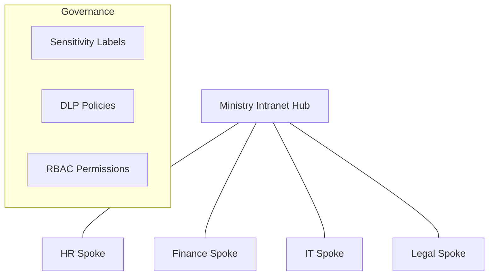

# Governance & Compliance Framework

This project implements a structured governance model for the Ministry Intranet, ensuring data integrity, security, and lifecycle management.

## 🏗️ Information Architecture

The site structure is defined in `site-schema.json`, following a hub-and-spoke model where the Ministry Home acts as the communication hub for departmental spoke sites (HR, Finance, IT, Legal).

### Site Structure Diagram

## 🔐 Permission Model (RBAC)

We use a three-tier permission model mapped to Microsoft Entra ID groups:

| Role | Permissions | Description |
| :--- | :--- | :--- |
| **Admin** | Full Control | Site collection administration, schema changes. |
| **Editor** | Edit, Delete, View | Content creation, document management. |
| **Reader** | View Only | Consumption of news and department resources. |

## 📂 Content Lifecycle Management

To prevent "sprawl" and ensure data relevancy, we implement the following policies:

1.  **Quarterly Reviews**: Departmental leads must review their site content every 3 months.
2.  **Retention Policies**:
    *   **Financial Records**: Retained for 7 years.
    *   **General Documents**: Archived after 2 years of inactivity.
    *   **Drafts**: Deleted after 6 months if not published.
3.  **Sensitivity Labels**:
    *   `Public`: No encryption, open access.
    *   `Internal`: Accessible to all ministry employees.
    *   `Confidential`: Encrypted, restricted to specific Entra ID groups.

## 📋 Compliance Standards

* **DLP (Data Loss Prevention)**: Automatically detects and blocks the sharing of National ID numbers or sensitive financial data in SharePoint libraries.
* **Audit Logging**: All file deletions and permission changes are logged in the M365 Compliance Center.
