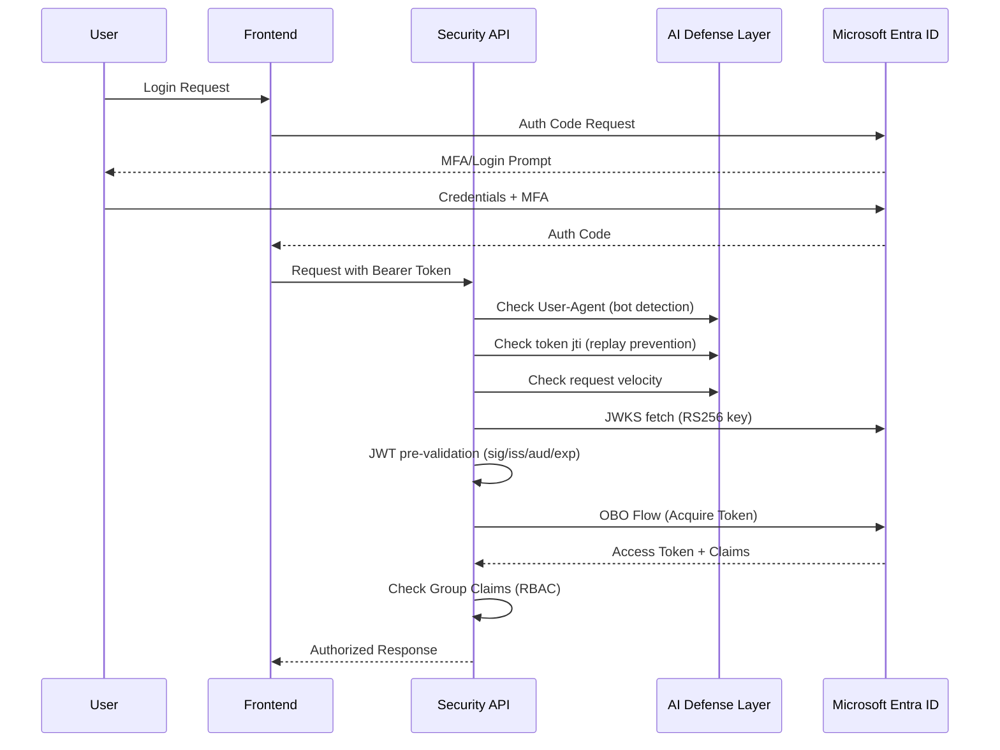

# Security & Compliance Lab

[](ZERO-TRUST.md)
[](aiAgentDefense.js)
[](SECURITY.md)

## 📝 Project Summary

This project demonstrates a **production-hardened** Microsoft 365 security and compliance implementation, featuring a Zero Trust API server with dedicated defenses against the rising threat of **AI agent-based attacks**.

---

## 🤖 AI Agent Defense Architecture

Modern AI agents can autonomously enumerate APIs, replay tokens, inject prompts, and chain vulnerabilities at machine speed. This lab implements **11 layers of defense**:

```
┌──────────────────────────────────────────────────────────────┐
│                      INCOMING REQUEST                        │
└──────────────────────────┬───────────────────────────────────┘
                           │
          ┌────────────────▼────────────────┐
          │  L1: Helmet CSP + Security Hdrs │  ← X-Robots-Tag, HSTS, CSP
          └────────────────┬────────────────┘
                           │
          ┌────────────────▼────────────────┐
          │  L2: Geo-Aware Throttling       │  ← Cloud/AI IP tier limits
          └────────────────┬────────────────┘
                           │
          ┌────────────────▼────────────────┐
          │  L3: Fingerprint Anomaly Detect │  ← Missing headers, headless UA
          └────────────────┬────────────────┘
                           │
          ┌────────────────▼────────────────┐
          │  L4: Prompt Injection Defense   │  ← 30+ LLM injection patterns
          └────────────────┬────────────────┘
                           │
          ┌────────────────▼────────────────┐
          │  L5: Agentic Chain Detection    │  ← Multi-step enumeration
          └────────────────┬────────────────┘
                           │
          ┌────────────────▼────────────────┐
          │  L6: AI Agent / Bot Detection   │  ← 28+ User-Agent patterns
          └────────────────┬────────────────┘
                           │
          ┌────────────────▼────────────────┐
          │  L7: Tiered Rate Limiting       │  ← Global + per-route limits
          └────────────────┬────────────────┘
                           │
          ┌────────────────▼────────────────┐
          │  L8: Strict CORS Enforcement    │  ← Origin allowlist
          └────────────────┬────────────────┘
                           │
          ┌────────────────▼────────────────┐
          │  L9: Token Replay Prevention    │  ← JWT jti nonce store
          └────────────────┬────────────────┘
                           │
          ┌────────────────▼────────────────┐
          │  L10: JWT Cryptographic Verify  │  ← RS256 + JWKS
          └────────────────┬────────────────┘
                           │
          ┌────────────────▼────────────────┐
          │  L11: MSAL OBO + RBAC           │  ← Entra ID + group permissions
          └────────────────┘
                           │
                    ✅ AUTHORIZED
```

> 📄 Full architecture details: [ZERO-TRUST.md](ZERO-TRUST.md)

---

## 🔐 Role-Based Access Control (RBAC) Implementation

### Authentication & Authorization Flow



### Configuration
1. Create a **Microsoft Entra ID** (formerly Azure AD) application registration.
2. Create a `.env` file based on `.env.example`:
   ```bash
   cp .env.example .env
   ```
3. Update `.env` with your Entra ID details:
   - `CLIENT_ID`: Your Application (client) ID (GUID)
   - `CLIENT_SECRET`: Your application client secret
   - `TENANT_ID`: Your Directory (tenant) ID (GUID)
   - `REDIRECT_URI`: Your application's redirect URI
   - `ADMIN_GROUP_ID`, `MANAGER_GROUP_ID`, `EMPLOYEE_GROUP_ID`: Object IDs of Entra ID groups
   - `ALLOWED_ORIGINS`: Comma-separated list of allowed CORS origins
4. Install dependencies:
   ```bash
   npm install
   ```

### Usage
```javascript
const { authenticate, authorize } = require('./authMiddleware');
const { detectAIAgent, preventTokenReplay, detectVelocityAbuse } = require('./aiAgentDefense');

// Full Zero Trust protection stack
router.get('/secure',
  detectAIAgent,          // Block AI agents/bots
  detectVelocityAbuse,    // Block enumeration
  preventTokenReplay,     // Block token replay
  authenticate,           // Verify identity (JWT + MSAL)
  (req, res) => { ... }
);

// With RBAC
router.post('/admin',
  detectAIAgent,
  preventTokenReplay,
  authenticate,
  authorize(['*']),       // Admin only
  (req, res) => { ... }
);
```

---

## 🧩 Features Implemented

### Zero Trust & AI Defense
* **AI Agent Detection**: 28+ User-Agent pattern signatures for known AI frameworks (LangChain, AutoGPT, OpenAI agents, Playwright, Puppeteer, etc.)
* **Token Replay Prevention**: JWT `jti` nonce tracking — each token is single-use within its TTL
* **Behavioral Anomaly Detection**: Per-IP velocity tracking (30 req/min threshold on auth routes)
* **JWT Cryptographic Pre-Validation**: RS256 signature verification via Microsoft's JWKS endpoint before any MSAL call
* **Header Injection Protection**: Regex sanitization and length limits on Authorization headers
* **Sanitized Error Responses**: No internal details, stack traces, or MSAL error messages exposed
* **Prompt Injection Defense**: 30+ regex patterns blocking LLM instruction overrides, jailbreaks, system prompt injections, and tool-call payloads (`promptInjectionDefense.js`)
* **Agentic Chain Detection**: Tracks multi-step API call sequences — detects AI agents enumerating endpoints in rapid succession within a 30-second window
* **Request Fingerprint Anomaly Detection**: Identifies headless browsers, missing browser headers, and suspicious User-Agent formats used by AI agents
* **Geo-Aware Throttling**: Tiered rate limits based on IP origin — cloud/AI provider ranges (AWS, Azure, GCP, DigitalOcean, OVH) get tighter limits; auto-escalates repeat violators to flagged tier (`geoThrottle.js`)

### Microsoft 365 Security
* **Data Loss Prevention (DLP)** policies for OneDrive and SharePoint
* **Sensitivity Labels** ("Confidential", "Internal Use") with encryption
* **Retention Policies** and audit logging for compliance
* **Conditional Access** rules with MFA enforcement
* **Threat Protection** configurations for email and endpoints
* **RBAC/IAM** system with three-tier role model

### API Hardening
* **Hardened Helmet CSP**: `default-src 'none'` — strictest possible policy
* **HSTS with Preload**: 1-year HTTPS enforcement
* **Tiered Rate Limiting**: Global (100/15min) + auth routes (20/5min)
* **Strict CORS**: Origin allowlist with violation logging
* **Request Body Limits**: 10KB maximum to prevent payload attacks
* **Structured Audit Logging**: 12 security event categories for SIEM integration

---

## 🛠️ Technologies Used

* Microsoft Purview
* Microsoft Entra ID
* Microsoft Defender for Office 365
* MSAL Node.js (`@azure/msal-node`)
* `jsonwebtoken` + `jwks-rsa` (JWT cryptographic validation)
* Express.js + Helmet.js
* Winston (structured logging)

---

## 📁 Folder Contents

```
03-security-lab/
├── .env.example              # Environment variable template (with all required vars)
├── .gitignore                # Excludes .env and node_modules
├── app.js                    # Zero Trust hardened Express server (11-layer defense)
├── authMiddleware.js         # JWT pre-validation, MSAL OBO, RBAC middleware
├── aiAgentDefense.js         # AI agent detection, token replay, velocity defense
├── promptInjectionDefense.js # Prompt injection, agentic chain & fingerprint detection
├── geoThrottle.js            # Geo-aware rate limiting (cloud/AI IP tiers, Cambodia SME)
├── logger.js                 # Structured security event logging (17 event categories)
├── package.json              # Dependencies (includes jsonwebtoken, jwks-rsa)
├── SECURITY.md               # Security policy
├── ZERO-TRUST.md             # Zero Trust architecture & AI agent threat model
├── test-demo.sh              # API testing script
└── README.md
```

---

## ✅ Skills Demonstrated

* Zero Trust architecture design
* AI agent threat modeling and defense
* JWT cryptographic validation (RS256/JWKS)
* Token replay attack prevention
* Behavioral anomaly detection
* Information protection policy design
* Compliance framework implementation (NIST 800-207, CIS M365 v3.0, OWASP API Top 10)
* Identity and access management
* Threat protection configuration
* Security reporting and monitoring
* Azure AD / Entra ID integration
* RBAC implementation

---

## 📌 Future Enhancements

* Replace in-memory nonce store with Redis for distributed token replay prevention
* Add Microsoft Sentinel integration for SIEM
* Implement Privileged Identity Management (PIM)
* Add Continuous Access Evaluation (CAE) support
* Deploy behind Azure API Management with WAF rules
* Add insider risk management policies

> ⚠️ Note: All configurations use simulated policies and test data. See [ZERO-TRUST.md](ZERO-TRUST.md) for the full security architecture.
